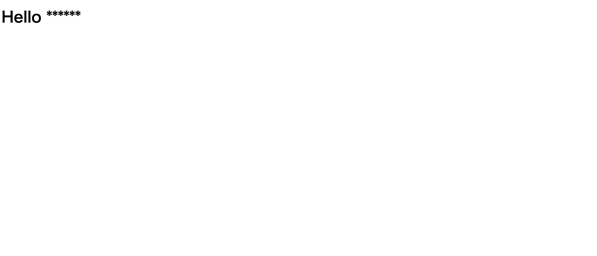
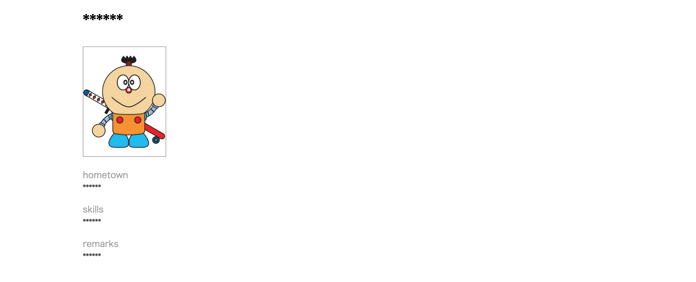

# Make the following application.
## **1) You have to use Codenvy**
## **2) Aplication name is [test_app]**
## **3) You have to use following command and code.**
* commands (You need to change from [XXXXXX] to proper words)

```Bash
rails new XXXXXX
```

```Bash
cd XXXXXX
```

```Bash
rails g controller XXXXXX XXXXXX
```


* routes.rb file
```ruby:routes.rb
root "top#profile"

get "top/index"
```


* top_controller.rb file ([XXXXXX]is Any string)
```ruby:top_controller.rb
def index

end
def profile
  @hometown = "XXXXXX"
  @skills = "XXXXXX"
  @remarks = "XXXXXX"
end
```


* profile.html.erb file ([XXXXXX]is your name)
```ruby:profile.html.erb
<div class="profile">
  <h1>XXXXXX</h1>
  <div class="profile_image">
    <%= image_tag 'image.jpg' %>
  </div>

  <div class='profile_detail'>
    <div class='label'>hometown<div>
    <div class='value'><%= @hometown %></div>
  </div>

  <div class='profile_detail'>
    <div class='label'>skills<div>
    <div class='value'><%= @skills %></div>
  </div>

  <div class='profile_detail'>
    <div class='label'>remarks<div>
    <div class='value'><%= @remarks %></div>
  </div>
</div>
```


* index.html.erb file ([XXXXXX]is your name)
```ruby:index.html.erb
<h1>Hello XXXXXX</h1>
```


* profile.css file
```ruby:profile.css
.profile {
  width: 960px;
  margin: 0 auto;
}
.profile_image img{
  width: 150px;
  height: auto;
  border: solid 1px #999999;
}
.profile_detail {
  margin-top: 15px;
}

.profile_detail .label{
  color: #999999;
}
.profile_detail .value{
  color: #333333;
}
```

## **4) You have to make a same as following application images.**
* http://XXXXXX/top/index ([XXXXXX] is your application URL.)


* http://XXXXXX ([XXXXXX] is your application URL.)(You can use your favorite image file.)

